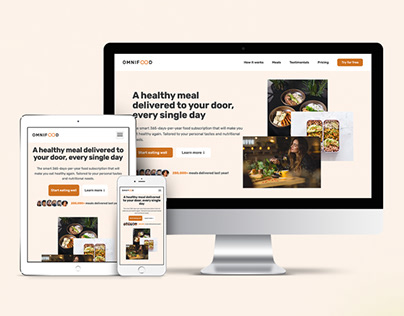

<div align="center">


[](https://twitter.com/codeaashu)

<br />
<br />


<h2 align="center">Omnifood Website</h2>
We are a technology company first, but with a major focus on consumer well-being through a healthy diet. Most people are very busy with their jobs, family and friends, and other important activities, which doesn't leave much time for cooking. This might lead to a poor diet and lasting health consequences. We want to solve this problem by using an AI-centric approach. Users can use our app to select their diet and foods they like and dislike, and our AI algorithm will create a custom and individual weekly meal plan. But we don't stop there. We partner with restaurants and other cooking partners to actually cook and deliver all meals from the generated meal plans, in selected cities. All this will be packed up in a monthly subscription, where users can choose between receiving one or two meals per day, every single day of the month.

<a href="https://omnifood-aashu.vercel.app/"><strong>➥ Live Demo</strong></a>

</div>

<br />

## Demo



## Prerequisites

Before you begin, ensure you have met the following requirements:

- [Git](https://git-scm.com/downloads "Download Git") must be installed on your operating system.

## Run Locally

To run **Omnifood**, run this command on your git bash:

Linux and macOS:

```bash
sudo git clone https://github.com/codeaashu/Omnifood.git
```

Windows:

```bash
git clone https://github.com/codeaashu/Omnifood.git
```

## License

MIT
